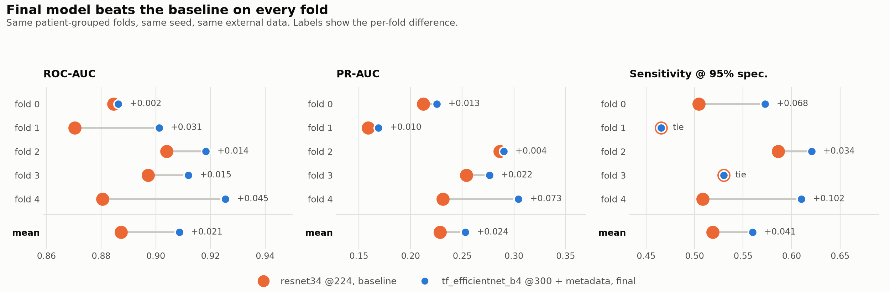

# The final model, what we built and what it scores

Author: Harutyun
Date: 30 August 2026
Branch: `final_arch_a_fixes`

## Short version

The experiment phase left a ResNet34 at 224 pixels scoring ROC-AUC 0.887, and a
list of things that would probably make it better. We built all of them into one
model: a bigger pretrained backbone at a higher resolution, GeM pooling, the
patient's sex, age and body site fused into the image features, mixup and cutmix,
a two stage fine tuning schedule, and flip test time augmentation.

It works. ROC-AUC goes from 0.887 to 0.909, and it wins on all five folds.

| | ROC-AUC | PR-AUC | Sens@95%Spec |
| --- | ---: | ---: | ---: |
| Random guessing | 0.500 | 0.0176 | 0.050 |
| resnet34 @224, the baseline | 0.8873 | 0.2285 | 0.5189 |
| **efficientnet-b4 @300 + metadata** | **0.9086** | **0.2530** | **0.5598** |
| change | **+0.0213** | **+0.0245** | **+0.0409** |

In melanomas rather than decimals: at a fixed 5% false alarm rate the baseline
finds 303 of the 584 cancers in the dataset and this model finds 327. Twenty four
more, for the same number of false alarms.

It cost 11.6 GPU hours against the baseline's 1.9. That is 6.2x the compute for
+0.021 ROC-AUC, which is the honest price of the last two points.

Two things stop this being the final word, and both are written up below: we did
not collect the out of fold predictions, so the number we most want to quote does
not exist yet; and the epoch selection has a test time augmentation confound that
makes the per fold numbers slightly inconsistent with each other.

## What the model actually is

`src/models/final_model.py`. Four pieces.

**Backbone.** `tf_efficientnet_b4` from timm, ImageNet pretrained, 300x300 input,
classifier head removed and global pooling disabled so the raw feature map comes
out.

**GeM pooling.** Generalised mean pooling with a learnable exponent `p`, initialised
at 3.0. `p=1` is average pooling and `p→∞` is max pooling, so the layer learns
where between the two it wants to sit. Melanoma is a local texture problem inside a
mostly uninformative field of skin, which is exactly the case where average pooling
dilutes the signal. It is forced to run in fp32; see the caveats.

**Metadata branch.** Entity embeddings for sex (3 categories) and anatomical site
(7), plus a small MLP on normalised age, projected to 256 dimensions. These are the
three columns the EDA found actually carry signal.

**Gated fusion.**

```
fused = image_features + gate(meta) * project(meta)
```

The gate scales an *additive* metadata contribution rather than multiplying the
image features. That direction matters: metadata on this dataset is missing and
occasionally wrong, and with this arrangement the worst a bad metadata row can do
is contribute nothing (`gate → 0`). It can never zero out the image branch, which is
what a multiplicative gate would allow.

A LayerNorm and a single linear layer turn the fused 256 vector into one logit.

## How it was trained

Five folds, grouped by patient, the same folds and the same seed as the baseline.
ISIC 2019 external data in training only; the assertion in `run_final_kaggle.py`
refuses to run if an external row reaches a validation fold.

| | |
| --- | --- |
| backbone / input | `tf_efficientnet_b4`, 300x300, ImageNet pretrained |
| epochs | 12 total: 2 with the backbone frozen, then 10 fine tuning all of it |
| schedule | 1 epoch linear warmup into cosine decay, over stage 2 only |
| learning rates | head `1e-3` both stages, backbone `3e-5` once unfrozen |
| optimiser | AdamW, weight decay `1e-4`, gradient clipped at norm 5 |
| loss | `BCEWithLogitsLoss`, `pos_weight` computed per split (≈9.41) |
| batch size | 32, mixed precision |
| augmentation | h/v flip, affine (±30°, ±5% shift, 0.9–1.1 scale), brightness/contrast jitter |
| mixup / cutmix | mixup α 0.4, cutmix α 1.0, applied to 50% of batches |
| TTA | 4 views (identity, h-flip, v-flip, both), last 3 epochs only |
| checkpoint selection | best validation ROC-AUC |
| hardware | Kaggle T4, two concurrent sessions, ~139 min per fold |

Two details worth naming because they are easy to get wrong:

Freezing the backbone in stage 1 also puts it in `.eval()`. Setting
`requires_grad=False` alone leaves BatchNorm updating its running statistics from
the new data, so a "frozen" backbone quietly drifts anyway.

Mixup and cutmix mix the images and the labels but leave the metadata index
aligned with the original batch. Interpolating a categorical embedding index is
meaningless, so the metadata is not mixed.

## Results



Per fold, validating on the fold named and training on the other four plus all of
ISIC 2019:

| fold | ROC-AUC | PR-AUC | Sens@95%Spec | best epoch | threshold | F1 | val photos | val melanomas | min |
| ---: | ---: | ---: | ---: | ---: | ---: | ---: | ---: | ---: | ---: |
| 0 | 0.8863 | 0.2253 | 0.5726 | 10 | 0.526 | 0.320 | 6,627 | 117 | 139 |
| 1 | 0.9012 | 0.1689 | 0.4655 | 8 | 0.610 | 0.289 | 6,625 | 116 | 140 |
| 2 | 0.9182 | 0.2901 | 0.6207 | 11 | 0.577 | 0.368 | 6,621 | 116 | 139 |
| 3 | 0.9119 | 0.2763 | 0.5299 | 10 | 0.679 | 0.349 | 6,628 | 117 | 139 |
| 4 | 0.9255 | 0.3044 | 0.6102 | 11 | 0.447 | 0.354 | 6,625 | 118 | 139 |
| **mean** | **0.9086** | **0.2530** | **0.5598** | | | **0.336** | 33,126 | 584 | 696 |
| std dev | 0.0153 | 0.0557 | 0.0636 | | | | | | |

Against the baseline, fold by fold:

| fold | ROC base | ROC final | Δ | PR base | PR final | Δ | Sens base | Sens final | Δ |
| ---: | ---: | ---: | ---: | ---: | ---: | ---: | ---: | ---: | ---: |
| 0 | 0.8846 | 0.8863 | +0.0017 | 0.2123 | 0.2253 | +0.0130 | 0.5043 | 0.5726 | +0.0684 |
| 1 | 0.8704 | 0.9012 | +0.0307 | 0.1589 | 0.1689 | +0.0100 | 0.4655 | 0.4655 | 0.0000 |
| 2 | 0.9039 | 0.9182 | +0.0143 | 0.2863 | 0.2901 | +0.0039 | 0.5862 | 0.6207 | +0.0345 |
| 3 | 0.8972 | 0.9119 | +0.0147 | 0.2539 | 0.2763 | +0.0223 | 0.5299 | 0.5299 | 0.0000 |
| 4 | 0.8805 | 0.9255 | +0.0450 | 0.2311 | 0.3044 | +0.0733 | 0.5085 | 0.6102 | +0.1017 |
| **mean** | 0.8873 | **0.9086** | **+0.0213** | 0.2285 | **0.2530** | **+0.0245** | 0.5189 | **0.5598** | **+0.0409** |

Five wins out of five on ROC-AUC and on PR-AUC. Four wins and two exact ties on
sensitivity, which never goes backwards. The two ties are not a coincidence of
rounding: sensitivity at a fixed specificity is a count of melanomas above a
cutoff, so with 116 and 117 positives it can only move in steps of about 0.009 and
landing on the same count twice is ordinary.

## Is the gain real?

Same folds, same seed, same data, so this is a paired comparison and the fold to
fold difficulty cancels out.

| metric | mean Δ | wins | paired t | Wilcoxon |
| --- | ---: | ---: | ---: | ---: |
| ROC-AUC | +0.0213 | 5/5 | p = 0.047 | p = 0.063 |
| PR-AUC | +0.0245 | 5/5 | p = 0.123 | p = 0.063 |
| Sens@95%Spec | +0.0409 | 4/5, 2 ties | p = 0.108 | p = 0.188 |

Read this carefully, because only one of those cells clears 0.05.

**ROC-AUC is significant, PR-AUC is not.** The PR-AUC improvement is +0.0245 on
average but the per fold deltas run from +0.004 to +0.073, and five samples with
that spread cannot produce a small p value. The mean gain is real in the sense
that it happened every time; it is not established at the 0.05 level.

**The Wilcoxon test cannot go below 0.0625 with five pairs.** With n=5 there are
2⁵ = 32 possible sign arrangements, so the smallest two sided p the test can ever
return is 2/32 = 0.0625. Both ROC-AUC and PR-AUC hit that floor, meaning the sign
was unanimous and the test has nothing left to say. Quoting "p = 0.063, not
significant" for these would be misreading the test.

**The strongest evidence here is the unanimity, not any p value.** Five folds,
five positive ROC-AUC differences: under a null of no effect that is a 1 in 32
outcome one sided, p = 0.031. PR-AUC gives the same 5/5 and sensitivity never goes
backwards, but those are not independent tests — they are three views of the same
five model pairs on the same five patient groups, so they cannot be multiplied
together into a smaller number. One clean sign test on the competition metric, and
two other metrics that agree with it, is the claim to defend.

### What it means in practice

At 95% specificity, meaning we accept a 5% false alarm rate on benign lesions,
summed across the five validation folds:

- the resnet34 baseline catches **303** of the 584 melanomas
- this model catches **327**

Twenty four more cancers found, no extra false alarms. Set against where the
project started, the same arithmetic puts the no-external baseline at **273**, so
the ISIC 2019 data bought 30 melanomas and the architecture bought another 24.
(The experiment report quotes 270 and 305 for those two; those come from pooled
out of fold predictions rather than a fold weighted sum of per fold sensitivities,
which is the better estimator and the reason to go and fetch `final_oof.csv`.)

## The test time augmentation confound

This is the one methodological problem in the run and it needs stating plainly.

`src/run_final_kaggle.py:177`:

```python
tta = args.tta if epoch > args.epochs - 3 else 1
```

TTA is only applied on the last three epochs, to save forward passes while the
model is still moving. Reasonable on its own. But the checkpoint is then selected
as the best validation ROC-AUC across *all twelve* epochs, and epochs 10 to 12 are
scored with a four view average while epochs 1 to 9 are scored with one view. TTA
is worth a few thousandths of ROC-AUC for free. So the selection is biased toward
the last three epochs, and it is not surprising that four of the five folds picked
one:

| fold | best epoch | scored with TTA? |
| ---: | ---: | --- |
| 0 | 10 | yes |
| 1 | 8 | **no** |
| 2 | 11 | yes |
| 3 | 10 | yes |
| 4 | 11 | yes |

Three consequences.

**The obvious "it was still improving at the cutoff" reading is not supported.**
Best epochs clustering at 10 and 11 out of 12 normally means the model was still
climbing and more epochs would help. Here it also has a much duller explanation:
those are the epochs that got a scoring bonus. The learning curves would settle
it, and we should look at them before spending another 12 GPU hours on longer
training.

**Fold 1's row is not measured the same way as the other four.** It reports
`tta,4` in `final_results.csv`, because that column records the `--tta` argument
rather than what the winning epoch actually used, but its metrics come from a
single view forward pass. Fold 1 also has by some distance the worst PR-AUC of the
five (0.169 against a 0.253 mean). Part of that gap is the missing TTA.

**Fold 1 was already the hardest fold for the baseline too** (PR-AUC 0.159, the
lowest of its five), so this is not purely an artefact. But the two effects are
tangled together and the run as it stands cannot separate them.

The fix is one line: score every epoch the same way. Either run TTA on every epoch
and pay for it, or select the checkpoint on plain single view predictions and
apply TTA once, afterwards, to the chosen checkpoint. The second is cheaper and
more correct.

## What is missing

**The out of fold predictions were not kept.** `run_final_kaggle.py` writes
`final_oof.csv` alongside `final_results.csv`, and it did not come back from
Kaggle with the results. Three things are blocked without it:

- the out of fold score, every one of the 33,126 competition photos scored exactly
  once by a model that never trained on it. `src/final_report.py` calls this "the
  number to quote" and it is right. Averaging five per fold numbers is not the
  same thing and is slightly more optimistic.
- a single deployment threshold. The per fold tuned thresholds run from 0.447 to
  0.679, a spread of 0.232, which is far too wide to pick one from. The threshold
  has to come from the pooled out of fold predictions.
- the fold ensemble, and any rank averaged ensemble across future runs, which is
  what `src/ensemble_oof.py` was written for. Historically this is worth more than
  any single architecture change.

Retrieving that file from the Kaggle working directory and running
`python src/final_report.py --in_dir reports` finishes the analysis. It costs
nothing; the models are already trained.

**No held out test fold.** The run used `--test_fold -99`, meaning nothing was
held back. Every fold's score is the best epoch measured on the same fold that
selected it, which is normal practice for choosing a checkpoint but makes the
number slightly optimistic. The baseline has exactly the same property, so the
*comparison* between them is fair even though the absolute numbers are not clean.
`src/evaluate_test.py` supports a genuinely untouched split and it has still not
been run.

**Whether the fp16 NaN bug touched this run.** GeM pooling with `p≈3` overflows
fp16: any activation above roughly 40 cubed passes the 65504 ceiling, becomes
`inf`, and pooling turns that into `NaN`. The fix that forces GeM into fp32 was
committed on 30 August at 02:29 (`da453e3`), and this run takes about six wall
clock hours per session. It is not clear from the results alone whether the run
predates the fix. `predict()` prints `WARNING: N of M predictions were NaN or inf,
replaced with 0.5` when it catches them, so the fold logs answer this directly.
Worth checking, particularly for fold 0: it improved by only +0.0017 ROC-AUC, the
smallest gain of the five, and predictions replaced with a neutral 0.5 would flatten
the ranking in exactly that way. This is a hypothesis to check in the logs, not a
finding.

## Honest caveats

**584 melanomas in total, about 117 per fold.** Every number here rests on a small
number of positive cases. PR-AUC in particular has a standard deviation of 0.056
across folds, which is more than twice the average improvement being claimed.
Treat any single fold difference under about 0.05 PR-AUC as noise unless it is
consistent across folds, which is the whole reason the analysis above is paired.

**The focal loss was built and not used.** `src/losses/focal_loss.py` exists,
`train_final.py` defaults to it, and `run_final_kaggle.py` defaults to `bce` — so
the run that produced these numbers used `BCEWithLogitsLoss` with a computed
`pos_weight`. Focal loss versus weighted BCE on this imbalance is an untested
one-line ablation.

**The backbone is not the one the code intends.** `final_model.py` defaults to
`tf_efficientnet_b4_ns`, the noisy student weights, which are generally worth a
little over plain ImageNet weights on this task. The run used `tf_efficientnet_b4`.
In current timm the noisy student checkpoint is named
`tf_efficientnet_b4.ns_jft_in1k`; the old `_ns` suffix no longer resolves. This is
free performance left on the table.

**Metadata fusion is not separately measured.** The model gained a bigger
backbone, more resolution, GeM, metadata, mixup/cutmix, a two stage schedule and
TTA all at once, against a baseline that had none of them. The +0.021 belongs to
that bundle. `--no_metadata` and `--no_gem` exist precisely to take it apart and
neither has been run.

**Cost.** 11.6 GPU hours for five folds against 1.9 for the baseline. On Kaggle's
30 hour weekly quota this is roughly a third of a week for one configuration, so
the ablations above have to be chosen rather than swept.

**Still not a medical device.** Same as everywhere else in this repository: a
triage aid on dermoscopic images, not a diagnosis, and the ISIC archive barely
contains dark skin. Sensitivity on skin tones the data does not cover is unmeasured
and should be assumed worse.

## What to do next, in order

1. **Get `final_oof.csv` off Kaggle and run `src/final_report.py`.** Free, and it
   produces the out of fold number, the deployment threshold and the fold ensemble.
   Nothing else on this list should happen first.
2. **Fix the TTA selection line.** One line, and it makes the five folds
   comparable to each other.
3. **Check the fold logs for the NaN warning.** Five minutes, and it either clears
   fold 0 or explains it.
4. **Switch to `tf_efficientnet_b4.ns_jft_in1k`.** Same cost, probably better
   weights.
5. **Run the `--no_metadata` ablation on two folds.** Roughly 4.5 GPU hours, and it
   answers whether the metadata branch earned its place — the part of this
   architecture that a reader will ask about first.
6. **Train longer, but only if the curves say so.** 16 to 18 epochs is the obvious
   next step and it is about 3.5 extra GPU hours per fold. Decide it from the
   learning curves after step 2, not from the current best-epoch column.
7. **Ensemble.** Different backbone, different resolution, rank average with
   `src/ensemble_oof.py`. This is usually worth more than any of the above and it
   is last only because it needs step 1 to be measurable.

## Reproducing this

On Kaggle, `kaggle/final_model_kaggle.ipynb`. Set the constants in cell 1 to what
was actually run — the committed defaults say `tf_efficientnet_b3`:

```python
FOLDS      = "0,1,2"    # and "3,4" in a second session
BACKBONE   = "tf_efficientnet_b4"
IMAGE_SIZE = 300
EPOCHS     = 12
BATCH_SIZE = 32
TTA        = 4
```

Accelerator T4, not P100: Kaggle's PyTorch build no longer compiles for Pascal, and
a P100 reports `cuda.is_available() == True` before failing on the first kernel
launch. Internet on, so timm can fetch the pretrained weights. Two sessions in
parallel halve the wall clock to about six hours.

Locally, or anywhere with a GPU:

```bash
python src/run_final_kaggle.py \
    --img_dir data/processed/train_512 \
    --metadata_csv data/processed/metadata_clean.csv \
    --out_dir reports \
    --backbone tf_efficientnet_b4 \
    --image_size 300 \
    --folds 0,1,2,3,4 \
    --epochs 12 \
    --tta 4 \
    --save_weights

python src/final_report.py --in_dir reports
```

`final_report.py` writes `reports/final_model_report.md`, the machine-generated
table. This document is the written-up version of it; the two are deliberately
different filenames because macOS filesystems are case-insensitive and
`final_report.md` would overwrite `Final_Report.md`.

Every finished fold is appended to `final_results.csv` and `final_oof.csv`
immediately and a restart skips what is already there, which matters when a
Kaggle session can die at any point in a twelve hour run. Seed is fixed at 42.

Raw per fold numbers: [`reports/final_results.csv`](final_results.csv). Baseline
numbers for the comparison: [`reports/results.csv`](results.csv), rows
`resnet34_224_ext`.
